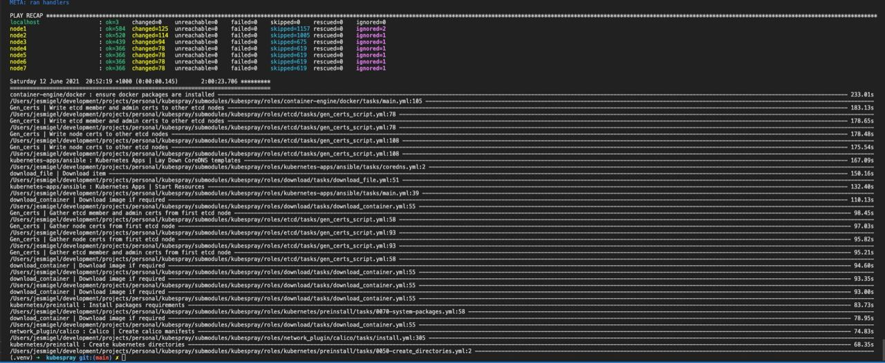

# kubespray
[Kubespray](https://github.com/kubernetes-sigs/kubespray) deployment against an ESXI host

### Dependencies
| Label | Comment |
| - | - |
| [Ansible](https://docs.ansible.com/) | Configuration management automation tool|
| [ESXI (6.7u3)](https://my.vmware.com/en/group/vmware/evalcenter?p=free-esxi6) | Hypervisor |
| [Python](https://www.python.org/downloads/) | Programming language required to run ansible |
| [Vagrant](https://www.vagrantup.com/docs) | VM manager. Local dev/test environment |
| [Virtualenv](https://docs.python.org/3/tutorial/venv.html) | Python environment isolation |
|||

### Preflight Steps
1. Copy the [sample.env.yaml](./sample.env.yaml) to `env.yaml` and populate the following fields
    - host: # ESXI host
    - user: # esxi user id
    - password: # esxi password

2. Initialise kubespray as submodule.
    - Update the tag version `_KUBESPRAY_TAG` in [kubespray.env](./kubespray.env)
    - Execute `make submodule`. This initialises and updates [kubespray](https://github.com/kubernetes-sigs/kubespray) as a submodule

3. Deploy VM
    - Execute `make up` to deploy n VM's to the ESXI host
    - *NOTE:* Execute `vagrant status` to perform a healtcheck
    - Execute `vagrant ssh ${NODENAME}` to ssh into ${NODENAME}

4. Prepare Ansible inventory
    - *NOTE*: IP addresses are an input to kubesprays [inventory builder](https://github.com/kubernetes-sigs/kubespray/tree/master/contrib/inventory_builder) script. VM's must be fully provisioned with accessible IPv4 from the ansible host before proceeding
    - Execute `make inventory`. This generates the inventory to be consumed by [kubespray](https://github.com/kubernetes-sigs/kubespray).
    - Update the inventory as needed. Default location is at ./inventory/cluster/hosts.yaml

### Deployment
1. Execute `make playbook` to run kubespray playbook `cluster.yml` against the nodes 
    - 

### Post Deployment
1. Obtain kubeconfig
    - Execute `make get_kubeconfig` to store kubeconfig locally to ./admin.conf. It also generate a source script src.sh

### ToDo
- Create dedicated directory for provisioning ignore files. Files in scope:
    - ssh.cfg
    - .ip
    - src.sh
    - env.yaml
    - admin.conf
- Create make targets involving an ansible playbook dry-run